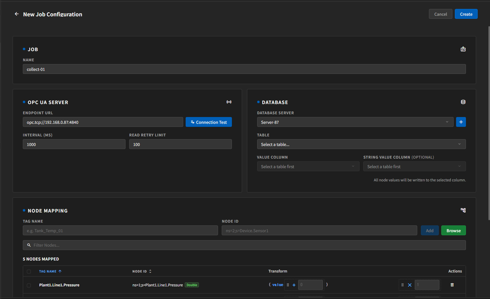
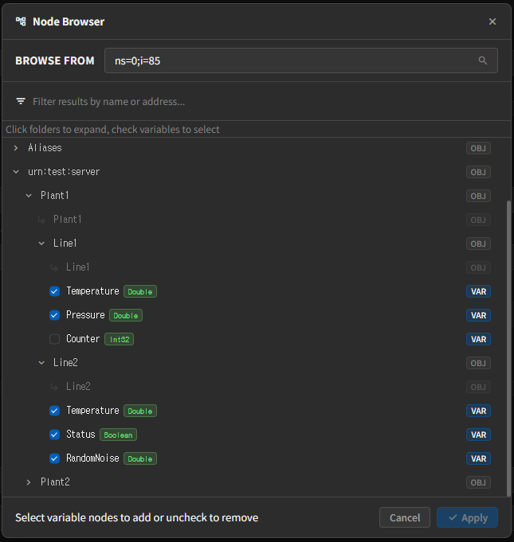

# Create and Run Jobs

## Create a New Job

Open **New Job** from the left sidebar to move to the job creation screen.

The screen is usually organized in this order:

- Job
- OPC UA
- Database
- Node Mapping
- Logging Controls

## Job Section

- `Name`
  - The name used to identify the job.

It is best to use letters, numbers, `_`, and `-` in the job name.

## OPC UA Section

Main input fields:

- `Endpoint URL`
- `Interval (ms)`
- `Read Retry Interval`

Descriptions:

- `Endpoint URL`
  - The OPC UA server address.
- `Interval`
  - The data collection interval.
- `Read Retry Interval`
  - The retry interval after a read failure.

It is usually safer to start with a stable interval instead of a very short one.

## Database Section

In this section, you choose which server, table, and column will store the collected data.

Main fields:

- `Database Server`
- `Table`
- `Value Column`
- `String Value Column`

Behavior:

- Numeric or boolean values can be stored in `Value Column`.
- String values can be stored separately in `String Value Column`.
- If the selected column is of type `JSON`, one cycle of collected data may be stored as a JSON payload.
- If the table has no numeric or JSON column, the form may switch to string-only mode.

## Node Mapping Section

This section is where you define the actual nodes to collect.

There are two input methods.

### Manual Input

- `Tag Name`
- `Node ID`

After entering the values, click **Add** to add them to the list.

### Browse

If the OPC UA Endpoint is already entered, you can click **Browse** to explore nodes from the server.

Nodes added through Browse may appear in the list with automatically generated names.  
You can click `Tag Name` in the mapped list to edit it directly, and press `Enter` or click outside the input to save it.

## Transform Settings

Each node in the list can have a Transform.

Basic concepts:

- `Bias`
- `Multiplier`
- Changing the calculation order

This is useful when you need value correction or scaling.

It is usually safer to confirm basic collection first without Transform, and then adjust only the nodes that need it.

## Logging Controls

At the bottom of the form, you can configure the log policy.

- `Log Level`
- `File Limit`

For normal operation, `INFO` or `WARN` is usually appropriate.

## Finish Create or Edit

- `Create`
  - Creates a new job.
- `Update`
  - Updates an existing job.
- `Cancel`
  - Returns without saving.

After creation, select the job from the sidebar and check its status.

## Navigation

- [Previous: Server Settings](./server-settings.en.md)
- [Back to Index](./index.en.md)
- [Next: Monitoring and Logs](./monitoring-and-logs.en.md)
