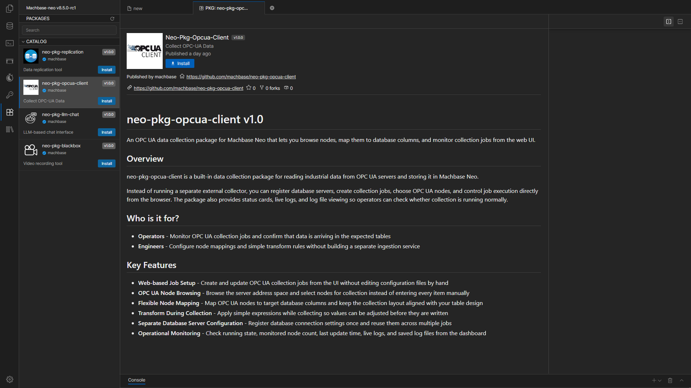
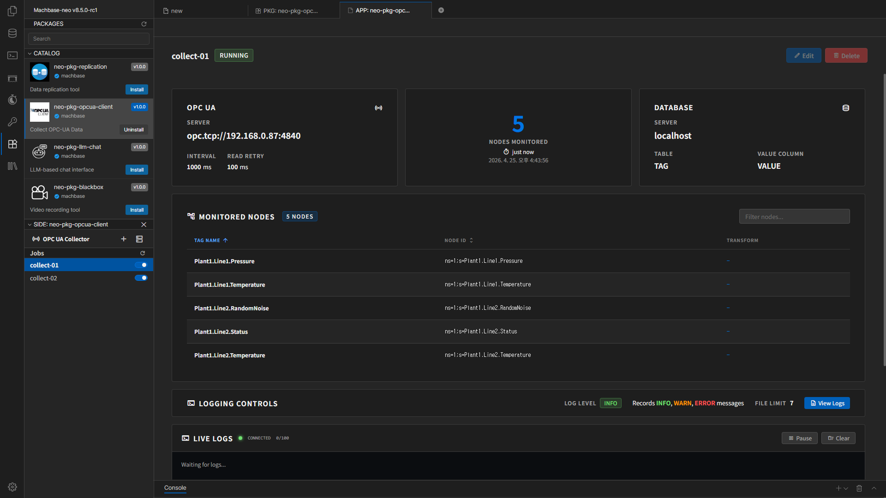

# OPC UA Client User Manual

[한국어](./index.kr.md) | **English**

This document explains how to install the **Machbase Neo OPC UA Client package**, register a Database Server, create jobs, check status, and review logs.

## Installation

The left sidebar in Machbase Neo shows the list of available packages.  
Select the OPC UA Client package and click the `Install` button to install it.

Installation may take a short time, so wait until it is completed.

## What This Manual Covers

- Package installation
- Database Server registration
- OPC UA collection job creation
- Node Mapping and Transform setup
- Job start/stop and status checks
- Log file review

## Basic Workflow

1. Install the OPC UA Client package in Neo.
2. Register a Database Server.
3. Create a new job.
4. Select the OPC UA Endpoint and target database table.
5. Map the nodes to collect.
6. Start the job and check its status from the dashboard.

## Screen Layout

- Left sidebar: job list, new job creation, and Server Settings
- Main area: selected job details or the create/edit form
- Modal windows: Database Server management and log viewing

## Documents

- [Server Settings](./server-settings.en.md)
- [Create and Run Jobs](./create-and-run-job.en.md)
- [Monitoring and Logs](./monitoring-and-logs.en.md)
- [Troubleshooting](./troubleshooting.en.md)

## Navigation

- [Next: Server Settings](./server-settings.en.md)
