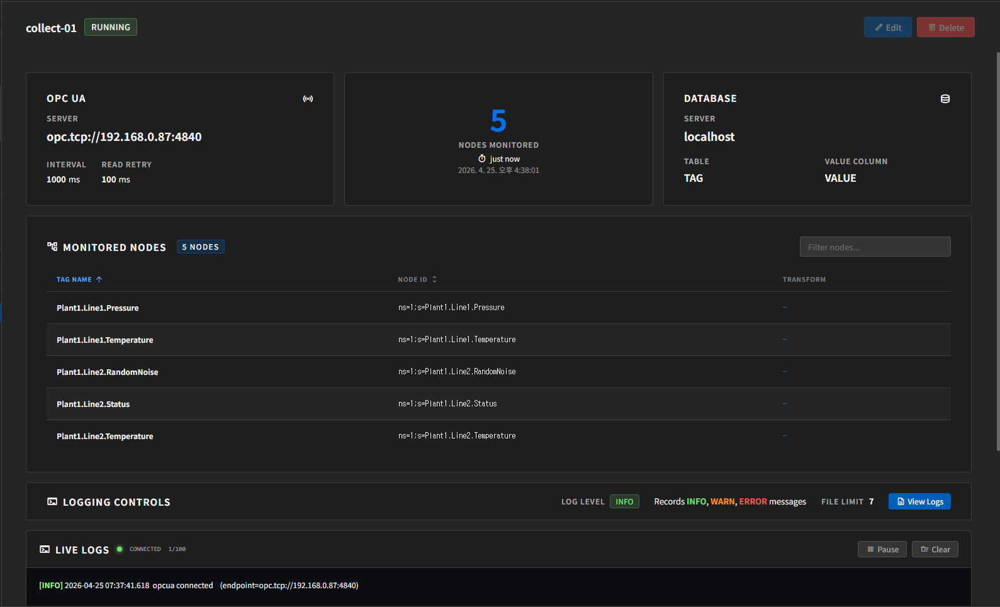
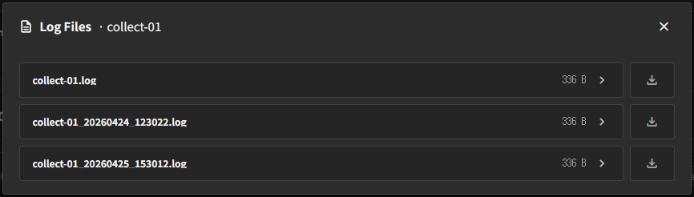

# 모니터링과 로그

## 대시보드에서 보는 항목

Job을 선택하면 우측 상세 화면에 다음 정보가 표시됩니다.

- Job 이름
- 현재 상태 (`running` / `stopped`)
- OPC UA endpoint
- Interval / Read Retry Interval
- Nodes Monitored 개수
- Last Updated At
- Database Server / Table / Column
- Logging Controls
- 실시간 로그

## 상태 해석

- `running`
  - 데이터를 수집 중입니다.
- `stopped`
  - 데이터 수집을 멈춘 상태입니다.

추가 상태 힌트:

- `Disconnected`
  - OPC UA 서버 접속 이상이 의심되는 상태
- `Stale`
  - 서버는 reachable하지만 최근 갱신이 오래된 상태

이 표시는 대시보드 상단 OPC UA 카드에서 badge로 나타날 수 있습니다.

## Nodes Monitored

중간 카드에서는 현재 모니터링 중인 Node 개수를 볼 수 있습니다.

함께 표시되는 정보:

- 마지막 수집 시각
- 사람이 읽기 쉬운 상대 시간

수집이 오래 멈춘 것처럼 보이면 endpoint 연결과 interval 설정을 먼저 확인하는 것이 좋습니다.

## Monitored Nodes 목록

하단 표에서는 현재 등록된 Node를 확인할 수 있습니다.

주요 컬럼:

- `Tag Name`
- `Node ID`
- `Transform`

화면에서 가능한 동작:

- 이름/Node ID 기준 필터
- 정렬

## Logging Controls

상세 화면 하단에는 현재 Job의 로그 설정이 요약되어 보입니다.

- `Log Level`
- 기록되는 로그 수준 안내
- `File Limit`
- `View Logs`

## 실시간 로그

상세 화면을 아래쪽으로 스크롤하면 **Live Logs** 카드가 나옵니다.  
상단 요약 카드만 보고 있으면 바로 보이지 않을 수 있으므로, 필요한 경우 아래로 내려서 확인합니다.

실시간 로그의 특징:

- 예전 로그 전체를 다시 보여주는 기능이 아니라, 현재 새로 발생하는 로그를 따라가는 기능입니다.
- 최근 새 로그가 없으면 화면이 비어 있을 수 있습니다.
- 로그 레벨을 `WARN`이나 `ERROR`처럼 제한적으로 설정한 경우에도 출력이 적거나 없을 수 있습니다.

화면에서 가능한 동작:

- `Pause`
- `Clear`

과거 로그 전체 확인은 **View Logs** 쪽이 더 적합합니다.

## Log Files 열기

Logging Controls 영역의 **View Logs** 버튼을 누르면 현재 Job의 로그 파일 목록이 열립니다.

## 로그 파일 목록

첫 번째 화면에서는 해당 Job과 관련된 로그 파일 목록을 볼 수 있습니다.

보통 다음 정보를 확인합니다.

- 파일 이름
- 파일 크기

과거의 로그 파일이 남아 있다면 목록에서 함께 보일 수 있습니다.

## 로그 파일 내용 보기

파일을 선택하면 해당 로그 내용을 볼 수 있습니다.

## 운영 중 권장 확인 순서

1. Job이 `running`인지 확인
2. Last Updated At이 최근인지 확인
3. Nodes Monitored 개수가 기대와 맞는지 확인
4. Database Server/Table/Column이 맞는지 확인
5. 화면 아래쪽의 Live Logs에서 현재 동작을 확인
6. 필요하면 View Logs로 상세 원인을 확인

## 문서 이동

- [이전: Job 생성과 실행](./create-and-run-job.kr.md)
- [목차로 돌아가기](./index.kr.md)
- [다음: 문제 해결](./troubleshooting.kr.md)
