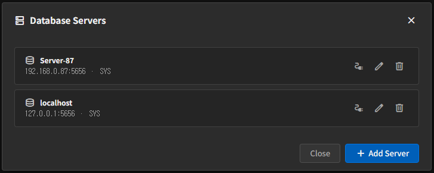

# Server Settings

In OPC UA Client, the first thing to register is not the **OPC UA Server** but the **Database Server**.  
You need to decide where collected values will be stored before you can select a table and column in the job form.

## Open Server Settings

Open Server Settings from the left sidebar to see the list of registered Database Servers.

Available actions:

- `Add Server`
- `Edit`
- `Delete`
- `Connection Test`

## Add a New Database Server

In most cases, you enter Machbase Neo connection information here.

Main input fields:

- `Name`
- `Host`
- `Port`
- `User`
- `Password`

Registration steps:

1. Click **Add Server**.
2. Enter the name, host, port, and account information.
3. If possible, check the connection with **Connection Test** first.
4. Click **Save**.

## Edit and Delete

- `Edit`
  - Updates the saved connection information.
- `Delete`
  - Removes the registered Database Server.

Be careful when deleting a server that is already used by a job, because it can affect future edits or restarts of that job.

## Notes

- The Database Server must work properly for the table and column lists to appear correctly.
- It is better to prepare the target table structure before creating a job.

## Navigation

- [Back to Index](./index.en.md)
- [Next: Create and Run Jobs](./create-and-run-job.en.md)
